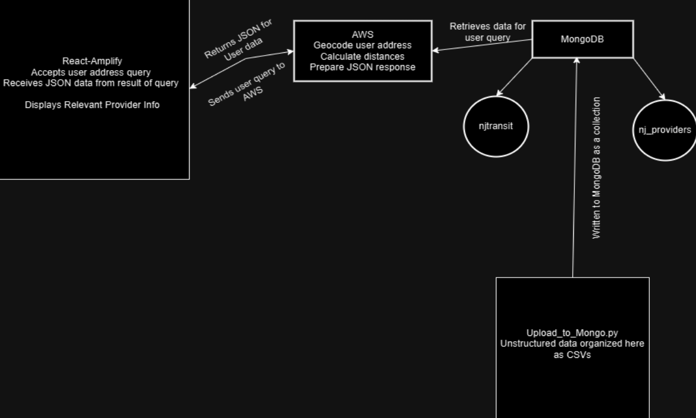

# 🚆🏥 System Design and Justification for NJ Transit and Provider Directory Software

## Authors: Allen Mena, Arianna Azizi, Samuel Habib, James Lee 

### Abstract

In New Jersey (and the greater United States), the issue of accessible healthcare provider data that is relevant to patients in these care systems is prevalent, and requires a solution that users can always access in order to obtain information pertinent to receiving care in their area. This currently does not exist on a state or national level, and the provider data currently available on the internet is unstructured at best, and at worst, unavailable without deep searching into provider coalitions and other organizations that try to represent what data they can find into their own directories. However, because this data exists in smaller directories, the goal is to add additional pertinent information that can be accessed by calculations made up of a combination of provider data, and NJ transit route information. This combination of data can lead to new insights as to which patients have the most difficult time getting to providers, and a calculated justification as to why.

For this application, Python, JavaScript, MongoDB, React, and AWS were all utilized to create a live platform that will be deployed locally using AWS as the event handler for user address submissions to find which providers are closest to them and how difficult it is to get to said providers. Through this process, calculations were able to be made for the closest provider, the closest bus stop to get to the provider, walkability index, and travel difficulty index, and this information was given to the user.

### Introduction

This application aims to solve two problems, and set a path for the application to be scaled out to the rest of New Jersey, and later on a national level. The first issue that this application aims to solve is the lack of structured data on a state level for a user to navigate through to find the provider and type of care they need. This problem is relevant because the arduousness of searching for a healthcare provider that matches your insurance and is close to you is significant, and can cost users time, or even a potential visit if they find the process too difficult to understand and give up their search prematurely.

The secondary problem that the application will solve through the distance and difficulty index calculations is how difficult it is for a patient to get to a provider using NJ transit. This question is relevant to New Jersey patients who do not have access to a car or other alternative transportation options outside of public transit, although future functionality could be added that includes distance by car and a comparison of commute types (additionally, the calculation to decide difficulty could be influenced by a figure like time to travel on public transportation vs. time to travel by car).

### Methodology

This section describes the approach taken to try and develop a provider and transit information application. The language stack for this project was Python for backend functions and calculations, and JavaScript for front-end design and UI development, with React as the framework for the front-end. The platforms utilized were AWS Lambda for Python script event handling and live hosting, MongoDB for database storage and information retrieval, Geoapify for hard coding longitude and latitude coordinates for providers and bus routes, OpenStreetMap API for dynamic coordinates based on user address entry, and React for local deployment of the project for testing. If there were fewer time constraints due to this being developed during a Hackathon, additional functionality could be added so the website exists as a URL that users can visit via Amplify.



First, since there were over 30,000 bus route locations, a subsection of New Jersey was taken, and a focus was applied to three major cities (Belleville, Neptune, and Morristown). This narrowed results down significantly, and allowed for free API calls to be made and research to be done on those areas. From there, those bus routes and their distance to the user are determined by the address that has been translated by OpenStreetMaps into a coordinate, which is compared to find the closest provider, and closest bus stop. Finally, the user is given back the following information: the name of provider, provider background information, address to provider, distance from user to provider in miles, distance to the closest bus stop, cross street for the closest bus stop, a URL to the provider’s site, a difficulty index that rates how difficult it is to get to a provider on a scale of 0-10, and an image key with a logo of the provider (due to time constraints this was not implemented and a string placeholder is present instead).

In order to construct a difficulty index, different factors were weighted into what makes it difficult for a user to travel to a provider. These factors include distance from provider to user in miles, distance to the closest bus stop, and walkability level.

### Difficulty Index

```python
def calculate_difficulty_index(walk_score, total_distance, bus_stop_distance, 
                               max_distance=10, max_bus_stop_distance=2, 
                               w1=0.5, w2=0.3, w3=0.2):
    # Normalize walk score (100 - walk_score) to a 0-10 scale
    normalized_walk_score = (100 - walk_score) / 10

    # Normalize total distance to a 0-10 scale (based on max_distance)
    normalized_total_distance = min(total_distance / max_distance * 10, 10)

    # Normalize bus stop distance to a 0-10 scale (based on max_bus_stop_distance)
    normalized_bus_stop_distance = min(bus_stop_distance / max_bus_stop_distance * 10, 10)

    # Calculate difficulty index, ensuring it's between 0 and 10
    difficulty_index = (w1 * normalized_walk_score + 
                        w2 * normalized_total_distance + 
                        w3 * normalized_bus_stop_distance)

    return round(min(difficulty_index, 10), 2)
```


